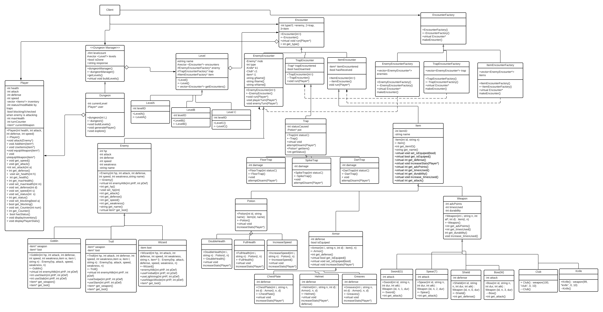

 # Escape from Darchom Dungeon
  Authors:  [Jimmy Li](https://github.com/jli283-hub), [Bradley Morck](https://github.com/football3o), [Shreya Chitturi](https://github.com/sc004)

## Project Description
This project is interesting to us because it allows a lot of possibilities and creative freedom. We can also give the user more freedom and these interactions can change how one
might reach the conclusion. This project also seems challenging, yet fun at the same time because we get to apply the concepts we learned in class in a fun way.

Language: C++

Github
Hammer

We will prompt the user with a few choices to choose from. Once the user decides what they would like to do, they will input their choice into the console. Based upon
the user’s input, the program will output what will now happen to the user as well as any stats that they may need to make future decisions.

Composite: The composite design pattern is a structural design pattern that focuses on the composition of objects and classes. In this specific pattern, we can create a tree
structure to represent hierarchies and it is made of four parts, component, leaf, composite, and client.
We picked the Composite pattern because it allows us to combine groups of objects together. An issue that we could come across in our game is when we are trying to let the
player know stats about their health and equipment. In our game, we will be using the composite pattern for the equipment and the different aspects of it. For example, we will
declare a class named CompositeEquipment which will act as the base class for equipment that contains other equipment. In addition, we can also use the composite pattern to keep
track of the stats of the player. 

Build: The build pattern is a creational pattern that creates independent complex objects using simpler objects and it is made up of the product, builder, concreteBuilder, and
Director.
We picked the Build pattern because it simplifies the creation of large objects that can be created using different components. We anticipate that we will have issues when
designing the multiple levels of our dungeon.  By using the builder pattern, it will simplify what is changed from level to level by adjusting variable values in the childs of
the main dungeon level builder class; we could break down our dungeon levels to specific components like number of enemies/chests/room count/traps/etc with each level altering
the values.

## Phase II

 > In addition to completing the "Class Diagram" section below, you will need to 
 > * Set up your GitHub project board as a Kanban board for the project. It should have columns that map roughly to 
 >   * Backlog, TODO, In progress, In testing, Done
 >   * You can change these or add more if you'd like, but we should be able to identify at least these.
 > * There is no requirement for automation in the project board but feel free to explore those options.
 > * Create an "Epic" (note) for each feature and each design pattern and assign them to the appropriate team member. Place these in the `Backlog` column
 > * Complete your first *sprint planning* meeting to plan out the next 7 days of work.
 >   * Create smaller development tasks as issues and assign them to team members. Place these in the `Backlog` column.
 >   * These cards should represent roughly 7 days worth of development time for your team, taking you until your first meeting with the TA
## Class Diagram
 > Include a class diagram(s) for each design pattern and a description of the diagram(s). Your class diagram(s) should include all the main classes you plan for the project. This should be in sufficient detail that another group could pick up the project this point and successfully complete it. Use proper OMT notation (as discussed in the course slides). You may combine multiple design patterns into one diagram if you'd like, but it needs to be clear which portion of the diagram represents which design pattern (either in the diagram or in the description). 
 
 > ## Phase III
 > You will need to schedule a check-in with the TA (during lab hours or office hours). Your entire team must be present. 
 > * Before the meeting you should perform a sprint plan like you did in Phase II
 > * In the meeting with your TA you will discuss: 
 >   - How effective your last sprint was (each member should talk about what they did)
 >   - Any tasks that did not get completed last sprint, and how you took them into consideration for this sprint
 >   - Any bugs you've identified and created issues for during the sprint. Do you plan on fixing them in the next sprint or are they lower priority?
 >   - What tasks you are planning for this next sprint.

 > ## Final deliverable
 > All group members will give a demo to the TA during lab time. The TA will check the demo and the project GitHub repository and ask a few questions to all the team members. 
 > Before the demo, you should do the following:
 > * Complete the sections below (i.e. Screenshots, Installation/Usage, Testing)
 > * Plan one more sprint (that you will not necessarily complete before the end of the quarter). Your In-progress and In-testing columns should be empty (you are not doing more work currently) but your TODO column should have a full sprint plan in it as you have done before. This should include any known bugs (there should be some) or new features you would like to add. These should appear as issues/cards on your Kanban board. 
 
 ## Screenshots
 > Screenshots of the input/output after running your application
 ## Installation/Usage
 > Instructions on installing and running your application
 ## Testing
 > How was your project tested/validated? If you used CI, you should have a "build passing" badge in this README.
 
